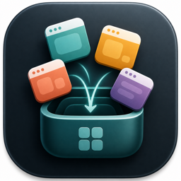

<p align="center">
  
</p>

<h1 align="center">GatherApps</h1>

[English](README.en.md) | 한국어 | [日本語](README.ja.md)

GatherApps은 여러 macOS 앱을 작업 단위로 묶고, 필요할 때 한 번에 앞으로 가져오는 SwiftUI 기반 macOS 앱입니다. 브라우저, 메신저, IDE처럼 함께 쓰는 앱들을 그룹으로 저장해 두면, 그룹 활성화만으로 해당 앱들의 창을 다시 띄울 수 있습니다.

## 주요 기능

- 실행 중인 앱 목록에서 앱을 선택해 그룹에 추가
- 그룹별 앱 목록 저장 및 삭제
- 그룹 아이콘 자동 생성
- 선택한 그룹의 앱 창을 한 번에 활성화
- 툴바 버튼으로 여는 플로팅 그룹 스위처
- 그룹별 Command-Tab 런처 앱 생성
- `gatherapps://activate-group/<GROUP_UUID>` URL 스킴을 통한 그룹 활성화

## 요구 사항

- macOS 14.0 이상
- Xcode 15 이상 권장
- 앱 창을 안정적으로 앞으로 가져오려면 macOS 접근성 권한이 필요할 수 있습니다.

## 시작하기

1. Xcode에서 `GatherApps.xcodeproj`를 엽니다.
2. `GatherApps` 스킴을 선택합니다.
3. Run을 눌러 앱을 실행합니다.
4. 사이드바의 `그룹 생성` 버튼으로 새 그룹을 만듭니다.
5. 오른쪽의 실행 중인 앱 목록에서 `+` 버튼을 눌러 그룹에 앱을 추가합니다.
6. `그룹 활성화`를 눌러 그룹에 포함된 앱 창을 앞으로 가져옵니다.

## Command-Tab 런처

각 그룹은 별도의 작은 macOS `.app` 런처로 생성할 수 있습니다. 생성된 런처는 일반 앱처럼 Command-Tab 전환기에 남아 있고, 선택하면 GatherApps에 그룹 활성화를 요청합니다.

- 생성 위치: `~/Applications/GatherApps Launchers/`
- 생성 방법: 그룹 상세 화면에서 `런처 생성` 클릭
- 자세한 구현 메모: [docs/launcher-apps.md](docs/launcher-apps.md)

## 데이터 저장 위치

GatherApps은 그룹 목록과 아이콘을 사용자 Application Support 영역에 저장합니다.

- 그룹 데이터: `~/Library/Application Support/GatherApps/groups.json`
- 그룹 아이콘: `~/Library/Application Support/GatherApps/Icons/`
- 윈도우 헬퍼 진단 파일: `~/Library/Application Support/GatherApps/window-helper-diagnostics.txt`

## 프로젝트 구조

- `GatherApps/`: 메인 SwiftUI 앱
- `GatherAppsWindowHelper/`: 앱 창을 올리는 보조 런타임
- `GatherAppsLauncherRuntime/`: 그룹별 런처 앱에서 사용하는 런타임
- `GatherAppsTests/`: 단위 테스트
- `GatherAppsUITests/`: UI 테스트
- `docs/`: 추가 설계 및 구현 문서

## 테스트

Xcode의 Test 액션을 사용하거나 터미널에서 다음 명령으로 테스트할 수 있습니다.

```sh
xcodebuild test -project GatherApps.xcodeproj -scheme GatherApps
```

## 참고

- 생성된 런처 앱은 로컬 개발용으로 기본 생성되며, 배포하려면 코드 서명과 notarization 절차가 필요합니다.
- 런처 앱은 직접 창을 제어하지 않고 GatherApps의 URL 스킴을 호출해 그룹 활성화를 위임합니다.
